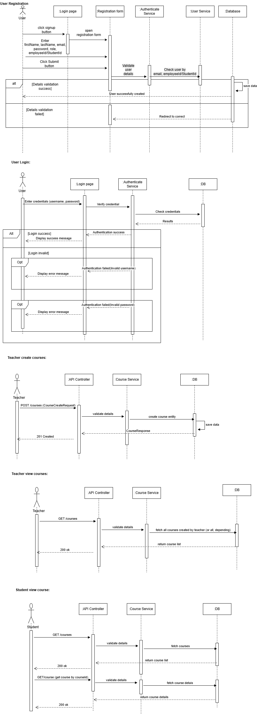

# Learning Management System Platform

A comprehensive Learning Management System built with Spring Boot, Java, and Maven. This platform supports user authentication (students, teachers(admins) and course management.

## Features:
   - Role-Based Authentication: Secure sign-up and login for Students, Instructors, and Administrators.
   - Course Catalog: Browse available courses, view details, and manage enrollment.

## Database ER Diagram:

## Tech Stack:
  - Framework: Spring Boot - Application Framework
  - Language: Java - Core programming language
  - Database: MySQL - Primary data storage (configurable)
  - Build Tool: Maven - Build automation and dependency management
  - Frontend: Thymeleaf/React/Angular(Specify your frontend technology)
  - Security: Spring Security Authentication and authorization

## Sequence Diagram:

